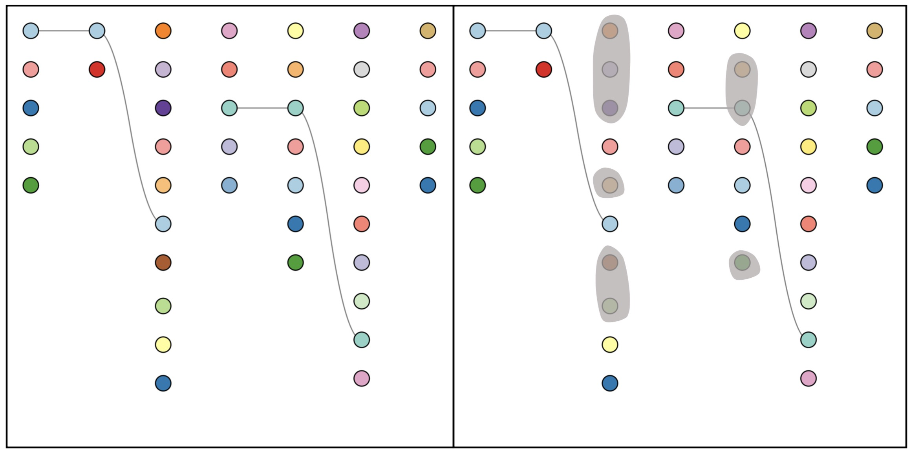

# PE-TESV
Towards Better Pattern Enhancement in Temporal Evolving Set Visualization

Zihao Zhu, Yue Shen, Sujia Zhu, Gefei Zhang, Ronghua Liang, Guodao Sun

This GitHub repo presents the results of our paper, which is accepted by ChinaVis2022.

This paper is now published at Journal of Visualization, [link](https://link.springer.com/article/10.1007/s12650-022-00896-x).

Each figure shows the orginal result of timeline visualization (left) and the result of pattern enhancement strategies (right).

## Abstract

Temporal evolving set data are time-varying and growing ubiquitous in person re-identification, parameter choice, and streaming data analysis. We construct a workflow to analyze and explore the inconspicuous pattern between multiple nonadjacent sets in temporal evolving set data. We propose a progressive timeline layout algorithm based on a mathematical optimization model to place the set element after data update, our layout algorithm can calculate the coordinates of elements in a short time and preserve the distance ratio between elements. To relax the visual clutter when visualizing sets’ relationships, we design two types of pattern enhancement strategies and their combinations: optimization-based pattern enhancement strategy and design-based pattern enhancement strategy. We conduct a comprehensive evaluation to verify and compare our pattern enhancement strategies including a quantitative experiment, two case studies, and an informal user study. The results show that our pattern enhancement strategies can effectively help users identify inconspicuous patterns. Our workflow and strategies show broad application prospects and we hope it could be a fundamental component in data projection pattern mining and streaming data analysis.

## Citation

```bibtex
@article{zhu2022towards,
  title = {{Towards Better Pattern Enhancement in Temporal Evolving Set Visualization}},
  journal = {Journal of Visualization},
  pages = {1-1},
  year = {2022},
  doi = {https://doi.org/10.1007/s12650-022-00896-x},
  author = {Zihao Zhu and Yue Shen and Sujia Zhu and Gefei Zhang and Ronghua Liang and Guodao Sun},
  keywords = {Temporal evolving set data, Pattern enhancement strategy, Progressive timeline layout algorithm}
}
```

## Table of Content

* [Comparsion of different columns](#Columns)
* [Case One](#Case1)
* [Case Two](#Case2)


## Columns

These results are the comparison of results that applied our pattern enhancement strategies in different columns.

### Element Movement

#### Column one and three


#### Column one and five


### Element Alignment

#### Column one and three


#### Column one and five


### Element Reorder

#### Column one and three


#### Column one and five


### Curve Link

#### Column one and three


#### Column one and five


### Element Movement + Curve Link

#### Column one and three


#### Column one and five


### Element Alignment + Curve Link

#### Column one and three


#### Column one and five


### Element Reorder + Curve Link

#### Column one and three


#### Column one and five


## Case1

Case $\mathrm{I}$ utilizes different projection methods and paramenters in a ReID dataset, the points in the timeline represent the outliers in each projection result.

### Element Movement


### Element Alignment


### Element Reorder


### Curve Link


### Bubble Link


### Flow Link


### Element Bundling



### Element Movement + Curve Link


### Element Movement + Bubble Link


### Element Movement + Flow Link


### Element Movement + Element Bundling


### Element Alignment + Curve Link


### Element Alignment + Bubble Link


### Element Alignment + Flow Link


### Element Alignment + Element Bundling


### Element Reorder + Curve Link


### Element Reorder + Bubble Link


### Element Reorder + Flow Link


### Element Reorder + Element Bundling


## Case2

Case $\mathrm{II}$ utilizes the Park dataset from [VAST challenge 2015](http://vacommunity.org/VAST+Challenge+2015), which records the locations of tourists in an amusement park. We choose the location information of tourists within ninety minutes, and filter the twenty-five tourists with the most location information.

The results of pattern enhancement strategies are shown as followings. Each circle denotes a tourist. We examine our strategies in the fourth and sixth column.

### Element Movement


### Element Alignment


### Element Reorder


### Curve Link


### Bubble Link


### Flow Link


### Element Bundling


### Element Movement + Curve Link


### Element Movement + Bubble Link


### Element Movement + Flow Link


### Element Movement + Element Bundling


### Element Alignment + Curve Link


### Element Alignment + Bubble Link


### Element Alignment + Flow Link


### Element Alignment + Element Bundling


### Element Reorder + Curve Link


### Element Reorder + Bubble Link


### Element Reorder + Flow Link


### Element Reorder + Element Bundling


